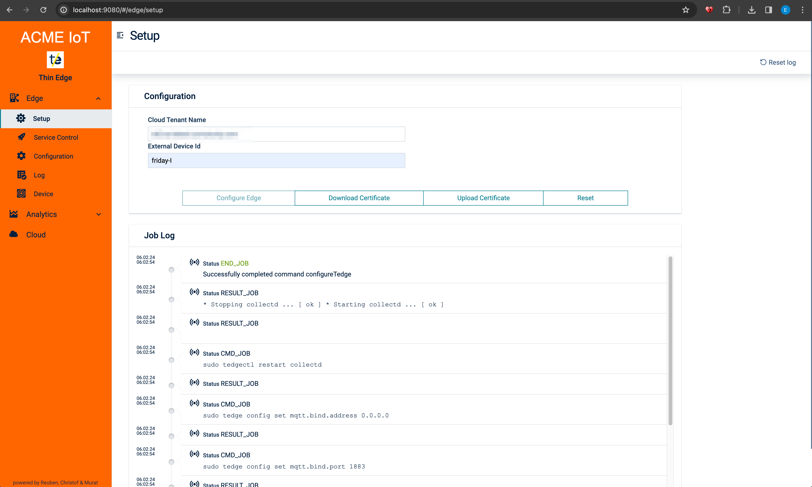
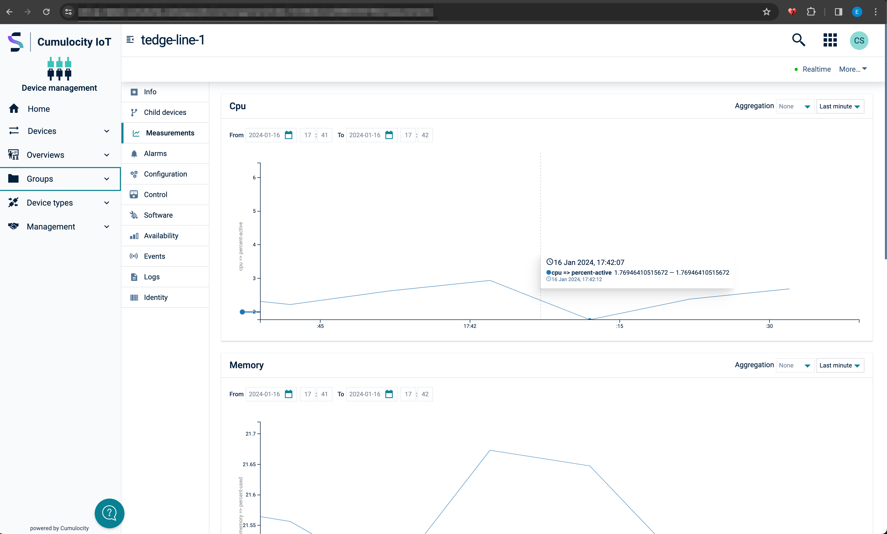
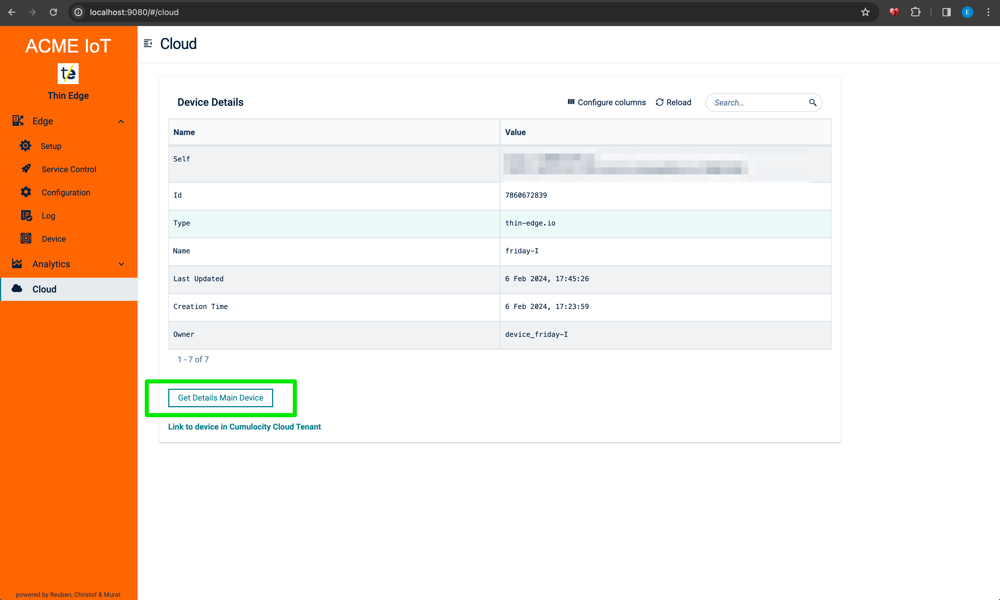
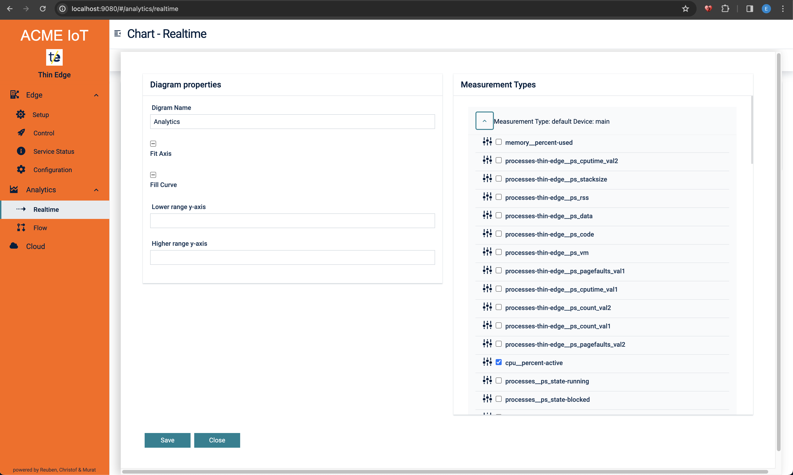
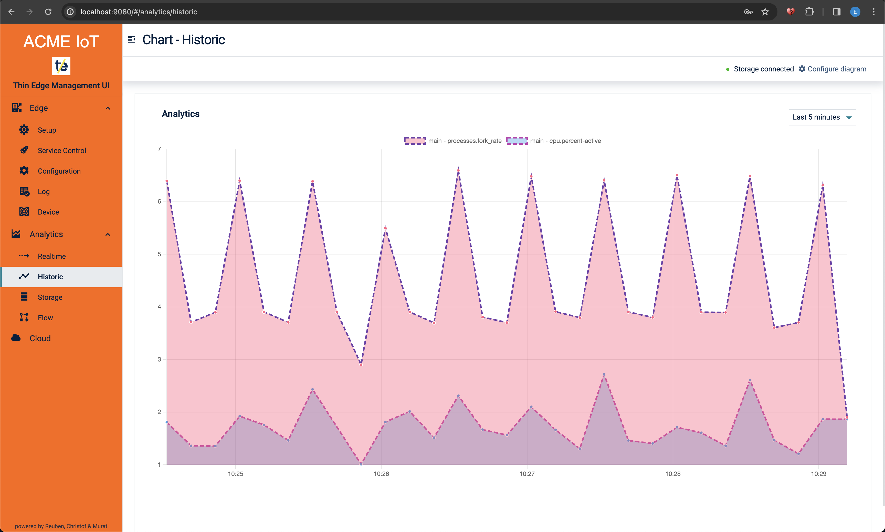

# Cumulocity thin-edge.io Management

This project adds an configuration ui to thin-edge.io. It enables you to use thin-edge.io with an easy-to-use docker based deployment and no code commissioning process. This helps to setup and monitor the edge using a web-ui:
* web-ui, for easy setup of the thin-edge.io 
* simple line chart to view streamed data and to view historical data
* component to store measurements locally in a mongo db
* run analytics scripts on the edge (Node-Red)

# Content
- [Content](#content)
- [Solution components](#solution-components)
- [Build thin-edge.io binaries and run solution](#build-thin-edgeio-binaries-and-run-solution)
- [Configure thin-edge.io in the web-ui](#configure-thin-edgeio-in-the-web-ui)
- [Analytics charts](#analytics-charts)
- [Contributing](#contributing)
- [License](#license)

# Solution components

This solution consists of 3 services:
* `tedge`: contains the thin-edge.io core services:
    * `tedge-agent`, `tedge-mapper`, `mosquitto` and `tedge-mgmt-server` app
    * Upon successful [configuration](http://localhost:9080/#/edge/setup) all system service in `tedge`can be [started](http://localhost:9080/#/edge/status)
* `node-red`: listens to measurements and can run analytics scripts on the edge
* `mongodb`: stores the measurements in a collection, to be retrieved by the web-ui. All measurements have time-to-live (TTL) of 3600. This can be changed in the [web ui](http://localhost:9080/#/analytics/storage):\
Analytics >> Storage >> Storage configuration

The above described service can be removed from the `docker-compose.yml` when memory and storage usage should be minimized. The solution can be build to run without `mongodb` and `node-red`, see environment settings: `STORAGE_ENABLED` and `ANALYTICS_FLOW_ENABLED` in `docker-compose.yml`
In this case only realtime measurements can be viewed and no historic measurements. 


The following diagram show how the components (`tedge-mgmt-server`, `node` backend, `tedge` processes) in the tedge service communicate:


# Build thin-edge.io binaries and run solution

The solution can be build in two different formats:
1. docker solution:\
To build the docker image the docker memory config must be set greater than 2GB, e.g. 4GB.
    To build the docker solution run:
    ```
    docker-compose up
    ```
2. linux package (deb, rpm, apk): to build the package follow the [instructions in the README](./tedge/package/README.md).

# Configure thin-edge.io in the web-ui

The configuration consists of the following steps:
1. specify device id and url of Cumulocity cloud tenant
2. configure thin-edge.io, i.e. create device certificate
3. upload certificate
3. start system service: `tedge-mapper`, `tedge-agent`, `collectd`, `mosquitto`

## Configuration and upload certificate

To start the configuration of the thin-edge.io use the [setup](http://localhost:9080/#/setup).
Here you start the setup of the edge and enter external device id and your Cumulocity tenant url.\

Then press `Configure edge` to create a device certificate. The thin-edge.io uses the certificate for authentication.
The certificate has to be uploaded through the web-ui: [Edge >> Setup >> Upload certificate](http://localhost:9080/#/edge/setup). As mentioned before, the certificate is uploaded to the cloud tenant.


Alternatively, you can download the certificate locally and upload it manually to your cloud tenant.


A detailed description how to import your certificate can de found is [Cumulocity Administration Documentation](https://Cumulocity.com/guides/users-guide/device-management/#managing-trusted-certificates) to your Cumulocity cloud tenant.\
Download the certificate.\

## Start system services
When the certificate is uploaded you can start the system services by pressing `Start edge`. If everything went well the completion of the startup is acknowledged.


The edge processes are started and the thin-edge.io is registered in the cloud tenant



The registration to the cloud can be verified [here](http://localhost:9080/#/cloud):



# Analytics charts

In order to use the charts you have to configure the data points to be viewed:


Then you can access the analytics charts in navigator [Analytics >> Realtime ](http://localhost:9080/#/analytics/realtime) or  [Analytics >> Historic ](http://localhost:9080/#/analytics/historic)


Then you can access the analytics charts in navigator [Analytics >> Realtime ](http://localhost:9080/#/analytics/realtime)


Or in case the solution is used with the storage component [Analytics >> Historic ](http://localhost:9080/#/analytics/historic)



When the storage component is not used you can only view measurement in realtime mode. The historic view is not available.


# Contributing

Contributions are what make the open source community such an amazing place to learn, inspire, and create. How you can contribute to thin-edge.io you can find in the Contribution Guideline

Any contributions you make are greatly appreciated. 


# License

Distributed under the Apache 2.0 License. See LICENSE for more information. 
